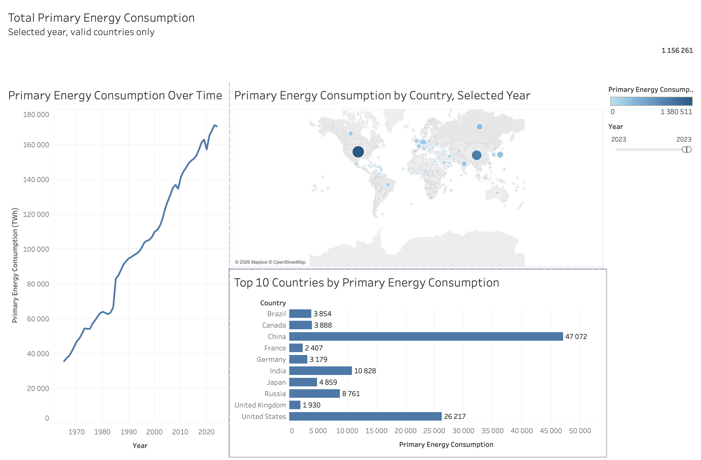
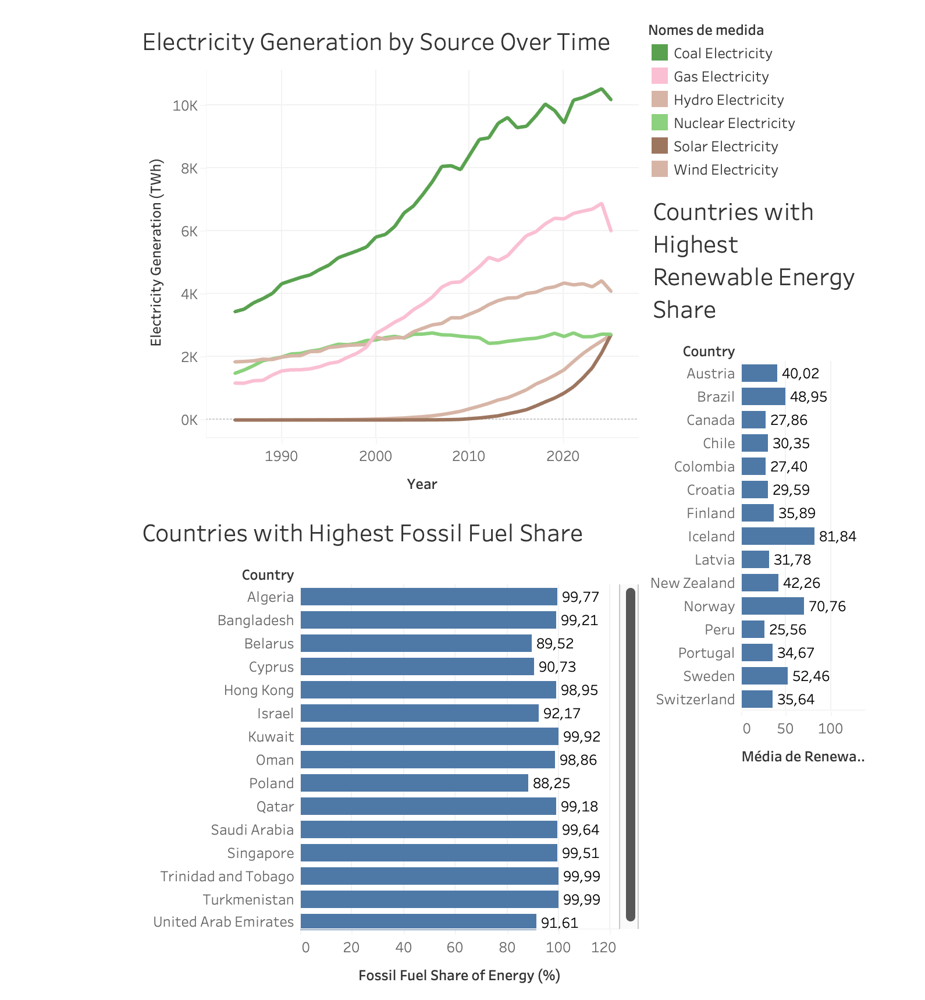
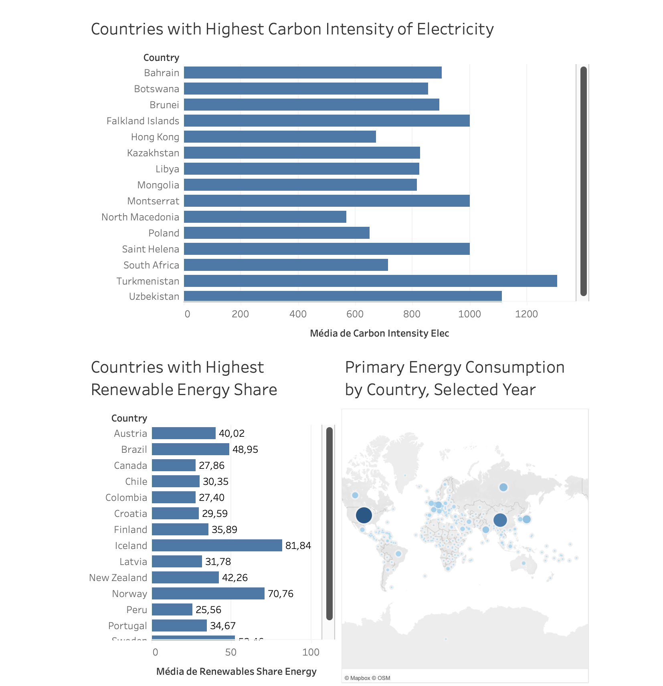

# SVDC - Exercício de Visualização

## Autor

**Vicente de Carvalho Castro**  
**Número:** PG60395  
**Disciplina:** Sistemas de Visualização de Dados e Conhecimento  
**Ferramenta utilizada:** Tableau Public

---

## 1. Introdução

Este projeto foi desenvolvido no âmbito da disciplina de **Sistemas de Visualização de Dados e Conhecimento**.

O objetivo do trabalho é aplicar técnicas de análise exploratória e visualização de dados a um dataset real, de forma a identificar padrões, tendências e mensagens relevantes através de dashboards.

Para este trabalho foi escolhido o **Energy Dataset**, com dados históricos sobre consumo energético, geração elétrica, fontes de energia, emissões e indicadores relacionados com sustentabilidade energética.

As visualizações foram criadas em **Tableau Public**.

---

## 2. Dataset

O dataset utilizado foi o **OWID Energy Dataset**, disponibilizado pela Our World in Data.

O ficheiro utilizado neste projeto foi:

```text
owid-energy-data.csv
```

O dataset contém informação por país e por ano, incluindo variáveis como:

- País;
- Ano;
- Código ISO;
- População;
- Produto Interno Bruto;
- Consumo de energia primária;
- Consumo de energia per capita;
- Produção elétrica por fonte;
- Percentagem de energia fóssil;
- Percentagem de energia renovável;
- Intensidade carbónica da eletricidade.

---

## 3. Objetivos da visualização

O objetivo principal deste projeto é analisar a evolução e distribuição do consumo energético mundial, bem como comparar a dependência de diferentes países em relação a fontes fósseis e renováveis.

As visualizações foram organizadas em três dashboards principais:

1. **Executive Summary**
   - Apresenta uma visão geral do consumo de energia primária.
   - Mostra a evolução temporal do consumo energético.
   - Identifica os países com maior consumo.
   - Mostra a distribuição geográfica do consumo energético.

2. **Energy Mix**
   - Compara diferentes fontes de geração elétrica ao longo do tempo.
   - Mostra países com maior dependência de combustíveis fósseis.
   - Mostra países com maior percentagem de energia renovável.

3. **Sustainability Analysis**
   - Analisa a intensidade carbónica da eletricidade por país.
   - Compara países com maior presença de energia renovável.
   - Relaciona consumo energético e sustentabilidade.

---

## 4. Preparação e transformação dos dados

O dataset foi importado diretamente para o Tableau a partir do ficheiro CSV.

Durante a preparação dos dados, foram realizados os seguintes passos:

1. Verificação dos campos disponíveis no dataset.
2. Confirmação dos tipos de dados:
   - `Country` como dimensão textual;
   - `Year` como valor numérico;
   - métricas energéticas como medidas numéricas.
3. Exclusão de agregados regionais ou globais através de um campo calculado.
4. Criação de filtros para analisar apenas países válidos.
5. Utilização de filtros por ano para permitir comparação entre países no mesmo período.
6. Seleção de métricas relevantes para consumo energético, fontes de eletricidade e sustentabilidade.
7. Criação de dashboards com diferentes níveis de análise: visão geral, composição energética e sustentabilidade.

---

## 5. Campos calculados

### 5.1. Valid Country

Este campo foi criado para filtrar apenas países com código ISO válido, evitando agregados como continentes, regiões ou grupos económicos.

```tableau
NOT ISNULL([Iso Code]) AND LEN([Iso Code]) = 3
```

### 5.2. Latest Year

Campo criado para identificar o ano mais recente disponível no dataset.

```tableau
{ FIXED : MAX([Year]) }
```

### 5.3. Is Latest Year

Campo criado para filtrar automaticamente o ano mais recente.

```tableau
[Year] = [Latest Year]
```

Em alguns gráficos foi utilizado um filtro manual por ano, especialmente quando o ano mais recente não continha valores completos para todas as métricas.

---

## 6. Visualizações desenvolvidas

Foram criadas várias visualizações no Tableau, incluindo:

- Cartão KPI com o consumo total de energia primária;
- Gráfico de linha com a evolução do consumo de energia primária;
- Mapa com a distribuição geográfica do consumo energético;
- Ranking dos países com maior consumo de energia;
- Ranking dos países com maior percentagem de energia fóssil;
- Ranking dos países com maior percentagem de energia renovável;
- Gráfico de linha com a evolução da geração elétrica por fonte;
- Ranking dos países com maior intensidade carbónica da eletricidade.

Estas visualizações foram organizadas em três dashboards.

---

## 7. Dashboards desenvolvidos

## 7.1. Executive Summary

O primeiro dashboard apresenta uma visão geral do consumo de energia primária.

Inclui:

- Indicador do consumo total de energia primária;
- Evolução do consumo de energia primária ao longo do tempo;
- Mapa com o consumo de energia por país;
- Ranking dos 10 países com maior consumo energético.



### Principais mensagens

Este dashboard mostra que o consumo global de energia primária tem aumentado de forma significativa ao longo das últimas décadas.

Também é possível observar que o consumo energético não está distribuído de forma uniforme entre os países. Pelo contrário, encontra-se concentrado em algumas grandes economias, como China, Estados Unidos, Índia e Rússia.

A visualização geográfica permite ainda perceber diferenças regionais no consumo energético, destacando países com maior peso no consumo global.

---

## 7.2. Energy Mix

O segundo dashboard foca-se na composição da geração elétrica e na comparação entre fontes fósseis e renováveis.

Inclui:

- Evolução da geração elétrica por fonte;
- Países com maior percentagem de energia fóssil;
- Países com maior percentagem de energia renovável.



### Principais mensagens

A geração elétrica a partir de carvão e gás continua a ter um peso muito relevante.

No entanto, fontes como energia solar e energia eólica apresentam um crescimento forte, especialmente nos anos mais recentes. Isto indica uma transição energética em curso.

Apesar desse crescimento, os combustíveis fósseis continuam a desempenhar um papel dominante em muitos países, o que mostra que a transição energética ainda é desigual entre regiões e economias.

---

## 7.3. Sustainability Analysis

O terceiro dashboard foca-se na sustentabilidade energética, analisando a intensidade carbónica da eletricidade e a presença de energias renováveis.

Inclui:

- Países com maior intensidade carbónica da eletricidade;
- Países com maior percentagem de energia renovável;
- Distribuição geográfica do consumo energético.



### Principais mensagens

Este dashboard mostra que existem diferenças significativas entre países na intensidade carbónica da eletricidade.

Países com maior dependência de fontes fósseis tendem a apresentar valores mais elevados de intensidade carbónica. Por outro lado, países com maior presença de energia renovável ou hidroelétrica apresentam, em geral, uma matriz energética mais sustentável.

A comparação entre intensidade carbónica e percentagem de renováveis permite compreender melhor o impacto ambiental associado à produção de eletricidade em diferentes países.

---

## 8. Resultados e conclusões

A análise permitiu retirar as seguintes conclusões:

1. O consumo de energia primária aumentou de forma clara ao longo das últimas décadas.
2. O consumo energético mundial está concentrado num número reduzido de países.
3. Os combustíveis fósseis continuam a ter um papel dominante na geração elétrica.
4. A energia solar e a energia eólica apresentam crescimento forte nos anos mais recentes.
5. A percentagem de energia renovável varia bastante entre países.
6. A intensidade carbónica da eletricidade depende fortemente da composição da matriz energética de cada país.
7. Países com maior dependência de carvão, petróleo ou gás tendem a apresentar maior intensidade carbónica.
8. A transição energética está em curso, mas acontece a ritmos diferentes conforme o país e a fonte de energia analisada.

---

## 9. Limitações

A análise apresenta algumas limitações:

- Nem todos os países têm dados completos para todos os anos.
- Algumas variáveis apresentam valores nulos em determinados períodos.
- O dataset inclui entidades agregadas, como regiões ou grupos económicos, que tiveram de ser filtradas.
- A comparação entre países pode ser influenciada por diferenças de população, dimensão económica e disponibilidade de dados.
- Alguns gráficos utilizam valores absolutos, que favorecem países de maior dimensão.
- A análise não considera diretamente fatores políticos, económicos ou tecnológicos que influenciam a transição energética.

---

## 10. Estrutura do repositório

```text
.
├── README.md
├── data/
│   └── owid-energy-data.csv
├── tableau/
│   └── svdc_energy_dashboard.twbx
└── images/
    ├── executive_summary.png
    ├── energy_mix.png
    └── sustainability_analysis.png
```

---

## 11. Ficheiros incluídos

- `README.md`: descrição do projeto, objetivos, transformações e resultados;
- `owid-energy-data.csv`: dataset utilizado;
- `svdc_energy_dashboard.twbx`: ficheiro Tableau com os dashboards;
- `executive_summary.png`: imagem do primeiro dashboard;
- `energy_mix.png`: imagem do segundo dashboard;
- `sustainability_analysis.png`: imagem do terceiro dashboard.

---

## 12. Ferramenta utilizada

O projeto foi desenvolvido com recurso ao **Tableau Public**, uma ferramenta de visualização de dados que permite criar dashboards interativos a partir de datasets estruturados.

O Tableau foi utilizado para:

- importar o dataset;
- criar campos calculados;
- aplicar filtros;
- construir gráficos;
- criar dashboards;
- exportar imagens dos resultados.

---

## 13. Considerações finais

Este trabalho permitiu explorar a evolução do consumo energético e a transição entre diferentes fontes de energia.

Os dashboards criados ajudam a comunicar padrões importantes, como o crescimento do consumo energético mundial, a concentração do consumo em grandes economias, a persistência dos combustíveis fósseis e o crescimento recente das energias renováveis.

A análise mostra que a transição energética é um processo visível nos dados, mas ainda incompleto e desigual entre países.
